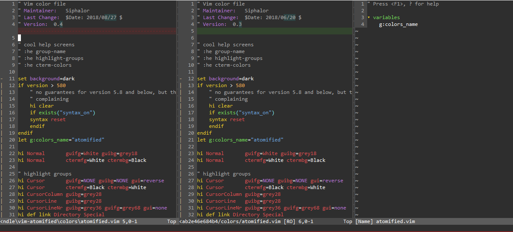

# vim-atomified
A special dark, not stupid-looking Vim colorscheme. Slightly inspired by Atom.

If you have any suggestions like support for specific languages or gui elements, just open an issue and I'll do what I can (and like to (: ).

## Install
You can easily "install" it by either downloading and copying the files or via [pathogen](https://github.com/tpope/vim-pathogen) through cloning this repository to your `bundle` directory.

## Screenshot

## Notes
You may want to `:set termguicolors` for some terminal's full color support.
